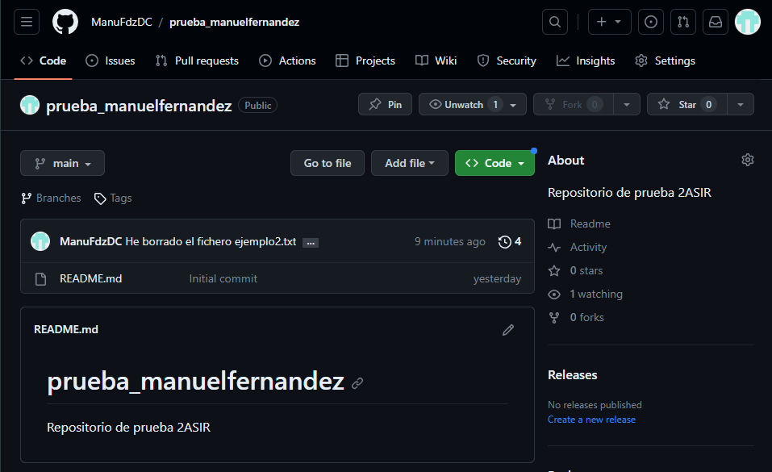

# Taller 1
## 1. Captura del repositorio creado en GitHub.


---

## 2. El contenido del fichero `.git/config`.
Para ver el contenido del archivo:

```cat .git/config```

```
[core]
        repositoryformatversion = 0
        filemode = false
        bare = false
        logallrefupdates = true
        symlinks = false
        ignorecase = true
[remote "origin"]
        url = git@github.com:ManuFdzDC/prueba_manuelfernandez.git
        fetch = +refs/heads/*:refs/remotes/origin/*
[branch "main"]
        remote = origin
        merge = refs/heads/main     
```

---

## 3. La salida de la instrucción `git log` para ver los commits que has realizado.


## 4. Buscar información para crear un nuevo repositorio llamado prueba2_tu_nombre. En esta ocasión, crea primero el repositorio local (usando `git init`) y luego busca información para sincronizarlo y crear el repositorio remoto en GitHub. Comenta los pasos que has realizado y manda alguna prueba de funcionamiento.

Lo primero es crear el repositorio:

`mkdir prueba2_manuelfernandez`

Ahora dentro del repositorio ejecutamos el comando `git init`.

Creamos un archivo en el repositorio:

```
touch archivo.txt
git add .
git commit -m "Creamos el archivo archivo.txt"
```
Despues de hacer todo esto en GitBash creamos un repositorio con el mismo nombre en GitHub.

Para sincronizar el repositorio remoto con el repositorio local utilizamos:

`git remote add (enlace ssh del repositorio remoto)`

Por ultimo subimos los archivos creados en local:

`git push origin main`

Pruebas de funcionamiento:
>Proceso seguido en GitBash


>Prueba de GitHub


